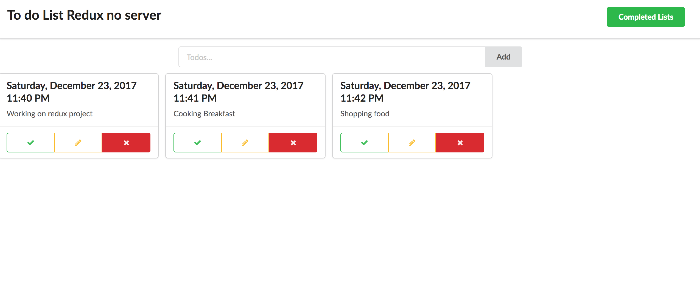
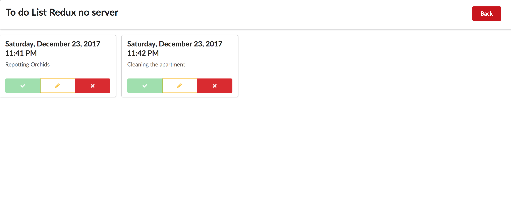

# todolists_redux

### Purposes
    To create a SPA with React and Redux libraly with no server side. 

### How this app works
    This appplication allows users to add todo lists, mark comleted, edit lists and delete lists. Users can also all the lists that are completed.

### Libraries
* React
* Redux
* Lodash

### Framework
* Semantic-ui-react

### To use this app

**Please click to start**
[Github page](https://kotchaparn-w.github.io/todolist_redux/)

 ***Let's take a look at todolists_redux***

